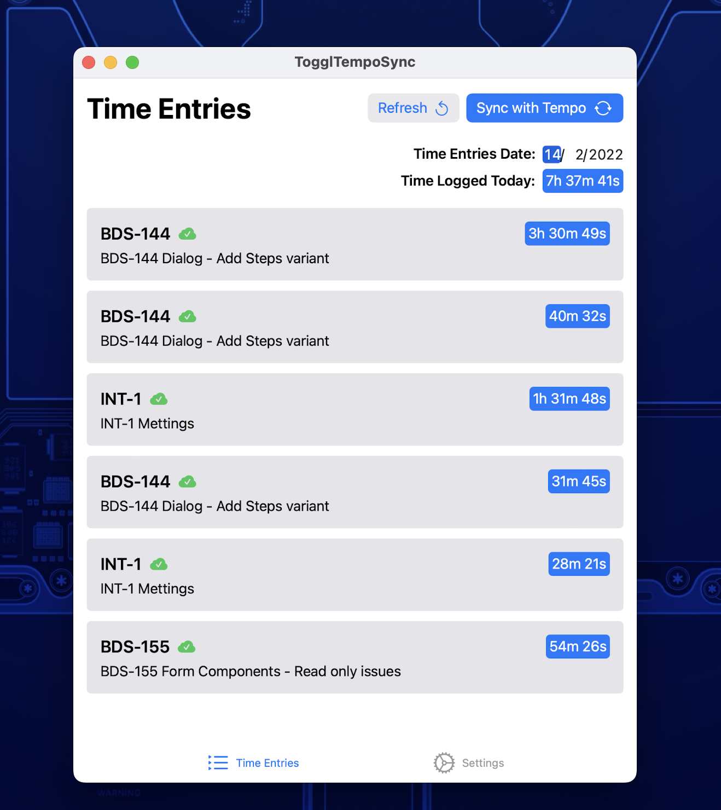

# Toogl Time Sync

This project is just a small Mac app that syncs toogl time entries with Jire Tempo. This can be useful for someone like me that uses Toggl but for some reason the company that you work for requires you to use Jira Tempo

## Usage

To use this project you will need:

- Your jira username
- Toogl key
- Tempo Key
- Jira key

## APIs that this app is using

Toogl API

- https://github.com/toggl/toggl_api_docs

Jira MySelf API

- https://developer.atlassian.com/cloud/jira/platform/rest/v3/api-group-myself/

Tempo API

- https://apidocs.tempo.io

## Sample

